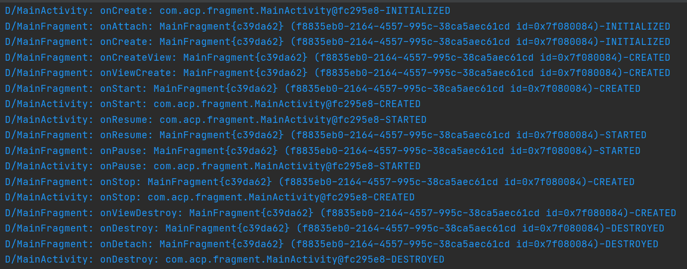
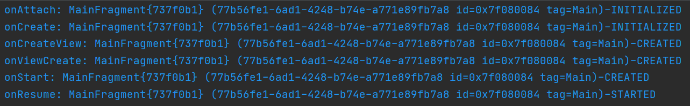
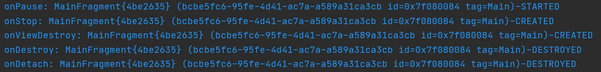

# Fragment

# 학습 목표

- Fragment가 생성되고 복구되는 과정을 이해한다.
- FragmentFactory의 목적을 이해하고 사용 방법을 학습한다.
- Fragment에 의존성을 전달하는 방법을 학습한다.
- SaveInstanceState의 동작 방식을 이해한다.
- FragmentTransaction마다 호출되는 라이프사이클 콜백, State 변경을 확인한다.

# Fragment 생성

Fragment를 생성하려면 두 가지 방법을 사용할 수 있다.

1. Fragment 객체의 수동 생성.
2. FragmentFactory를 사용한 객체 생성.

> FragmentFactory

Fragment 객체 생성을 제어하기 위해 사용되는 인터페이스. 이 클래스를 확장하는 클래스는 `FragemntManager.setFragmentFactory(FragmentFactory)` 메소드를 사용하여 FragmentManager에 등록되며 Fragment 객체를 생성하는 로직을 변경할 수 있다.

개발자가 Fragment를 FragmentManager에 추가할 때 코드상에서 직접 Fragment의 생성자를 호출하여 생성한 Fragment를 추가하는 것은 1번에 해당하며, Fragment의 인스턴스 대신 Class<Fragment>를 전달하여 추가하는 것은 2번에 해당한다.

Fragment가 추가되었을 때 구성 변경이 발생한다면 파괴된 Fragment 를 다시 생성하는 복구 작업이 필요하다. 이 작업은 시스템에서 자체적으로 수행되며, 마찬가지로 2번 방식을 사용하여 Fragment 객체를 생성한다.

어떤 방식을 사용하던지 애플리케이션은 정상적으로 동작한다. 하지만 만약 Fragment에서 생성자에 의존성을 받는다면 문제가 발생할 수 있다.

2번 방법으로 Fragment를 생성하는 코드를 살펴보자.

안드로이드 시스템에서 Fragment를 생성하는 과정은 FragmentTransantion 클래스의 createFragment에서 시작한다.

```java
@NonNull
private Fragment createFragment(@NonNull Class<? extends Fragment> fragmentClass,
        @Nullable Bundle args) {
    ...
    Fragment fragment = mFragmentFactory.instantiate(mClassLoader, fragmentClass.getName());
		...
    return fragment;
}
```

여기서는 mFragmentFactory를 사용하여 생성된 객체를 반환하는데, mFragmentFactory 필드에는 FragmentManager의 mHostFragmentFactory가 주입된다.

```java
FragmentTransaction(@NonNull FragmentFactory fragmentFactory,
        @Nullable ClassLoader classLoader) {
    mFragmentFactory = fragmentFactory;
    mClassLoader = classLoader;
}
```

FragmentManager의 mHostFragmentFactory는 FragmentFactory 클래스를 확장하는 익명 클래스로 instantiate 메소드를 재정의하여 Fragment를 생성하는 작업을 Fragment 클래스의 instantiate 메소드에 위임한다.

```java
private FragmentFactory mHostFragmentFactory = new FragmentFactory() {
    @SuppressWarnings("deprecation")
    @NonNull
    @Override
    public Fragment instantiate(@NonNull ClassLoader classLoader, @NonNull String className) {
        return getHost().instantiate(getHost().getContext(), className, null);
    }
};
```

최종적으로 Fragment를 생성하는 코드를 보면, FragmentFactory의 static 메소드를 사용하여 생성하려는 Fragment의 Class 객체를 얻은 후, 해당 클래스에서 파라미터가 없는 기본 생성자를 참조하여 Fragment 객체를 생성한다.

```java
@Deprecated
@NonNull
public static Fragment instantiate(@NonNull Context context, @NonNull String fname,
        @Nullable Bundle args) {
    try {
        Class<? extends Fragment> clazz = FragmentFactory.loadFragmentClass(
                context.getClassLoader(), fname);
        **Fragment f = clazz.getConstructor().newInstance();**
        if (args != null) {
            args.setClassLoader(f.getClass().getClassLoader());
            f.setArguments(args);
        }
        return f;
    } catch (java.lang.InstantiationException e) {
        ...
    }
}
```

문제는 기본 생성자를 참조하는 쪽에서 발생한다. 파라미터가 없는 생성자를 참조하기 때문에 사용자의 Fragment 클래스에 기본 생성자가 존재하지 않는다면 예외가 발생하여 애플리케이션이 중단된다.

그렇다면 Fragment에게 의존성을 주입하려면 어떻게 사용해야 할까?

생성자를 사용한 주입은 Fragment가 복구될 때 기본 생성자가 사용되기 때문에 사용에 제약이 있다. 대신 Bundle 객체를 사용한 argument의 전달은 Fragment가 복구될 때 시스템에서 자동으로 함께 복구해준다. 따라서 이전에는 Fragment 생성자 파라미터를 추가하는 대신 Fragment 객체를 생성하는 static 메소드에서 파라미터를 Bundle로 포장하여 전달하는 Fragment 정적 생성 방식이 사용되었다.

하지만 Bundle을 이런 방식은 직렬화 비용이 발생하고 전달할 수 있는 최대 데이터가 제한되기 때문에 단순한 premitive 값을 전달할 때는 유용하지만 복잡한 객체를 전달해야 하는 경우 사용하기란 무리가 있다.

현재는 FragmentFactory를 확장하여 Fragment 생성자에 직접 의존성을 주입하는 방식이 사용된다.

아래 코드는 문서에서 FragmentFactory를 확장하여 사용하는 예시를 보여준다.

```kotlin
class DessertsFragment(val dessertsRepository: DessertsRepository) : Fragment() {
    ...
}
```

```kotlin
class MyFragmentFactory(val repository: DessertsRepository) : FragmentFactory() {
    override fun instantiate(classLoader: ClassLoader, className: String): Fragment =
            when (loadFragmentClass(classLoader, className)) {
                DessertsFragment::class.java -> DessertsFragment(repository)
                else -> super.instantiate(classLoader, className)
            }
}
```

```kotlin
class MealActivity : AppCompatActivity() {
    override fun onCreate(savedInstanceState: Bundle?) {
        supportFragmentManager.fragmentFactory = MyFragmentFactory(DessertsRepository.getInstance())
        super.onCreate(savedInstanceState)
    }
}
```

# SaveInstanceState

기기의 구성 변경 등을 이유로 Fragment는 애플리케이션 실행 중 시스템에 의해 파괴되거나 복구될 수 있다. 이때 id를 가지는 뷰의 상태는 자동으로 복구되지만 Fragment 객체의 멤버 변수들의 값은 보존되지 않는다.

일반적으로 구성 변경에 독립적으로 데이터를 보존하기 위해선 ViewModel을 사용할 수 있다. 하지만 프로세스, Activity가 메모리 확보 등을 이유로 시스템에 의해 강제로 종료되는 경우라면 ViewModel의 데이터를 보존할 수 없다(ViewModel의 Saved State module 관련 내용은 제외한다).

이 경우엔 Fragment의 onSaveInstanceState와 onRestoreInstanceState를 재정의하여 필요한 데이터를 저장하고 복구해야 한다.

Fragment의 onSaveInstanceState 콜백은 호스트 Activity에 종속적이다. 호스트 Activity의 onSaveInstanceState가 호출돼야 Fragment의 onSaveInstanceState 또한 호출된다.

Activity의 onSaveInstanceState는 Activity가 자신의 활성 수명 주기를 완료할 때 호출된다. 하지만 Activity가 완전히 종료되었다고 판단되었을 때는 해당 콜백을 호출하지 않는다. 이에 해당하는 경우는 다음과 같다.

- 뒤로 버튼 누르기
- 최근 사용 화면에서 Activity 스와이프
- Activity에서 상위 항목으로 이동
- 설정 화면에서 앱 종료
- `finish()` 호출

onSaveInstanceState에서 저장되는 데이터는 SIS(Saved Instance State)에 저장된다. SIS는 안드로이드 운영체제가 일시적으로 외부에 저장하는 데이터를 말한다.

SIS를 사용한 데이터 저장을 할 때 주의사항은 복잡한 데이터 구조를 저장해서는 안된다는 점이다. onSaveInstanceState에 의해 저장되는 데이터는 디스크에 직렬화되며, 메인 스레드에서 수행된다. 직렬화 대상이 되는 데이터가 복잡하다면 이 과정에서 많은 비용이 필요할 수 있고, 작업이 지연된다면 프레임 드랍이 발생할 수 있다.

# Fragment lifecycle

Fragment의 라이프사이클은 기본적으로 호스트의 라이프사이클에 맞춰진다. 즉, 호스트 Activity가 onResume까지 호출되었다면 Fragment도 onResume까지 호출하며, 홈 버튼을 눌러 Activity가 onStop까지 호출된다면 Fragment 또한 onStop까지 호출된다.

이 때, Activity의 레이아웃 상에서 Fragment가 이미 명시되었다면 Fragment의 라이프사이클은 Activity 라이프사이클 이후 바로 호출된다. 다음 예시는 Fragment 하나를 가지는 Activity를 시작시킨 후 종료시켰을 때의 호출되는 라이프사이클 콜백을 보여준다. 로그는 각각의 라이프사이클 콜백에서 super.onXXX 메소드 이후 출력된다.



Activity가 Fragment를 호스트하므로 시작될 때는 Activity의 라이프사이클이 먼저 호출되고 종료될 때는 Fragment의 라이프사이클이 먼저 호출되는 것이 이치에 맞다. 다만 Activity의 onStart의 경우 로그 상 Fragment보다 나중에 호출되는 것 처럼 보이는데 이는 다른 라이프사이클 콜백과 달리 Fragment의 onCreateView, onViewCreate, onStart 등의 콜백이 Activity의 onStart가 호출된 이후가 아니라 Activity의 onStart 콜백 내에서 호출되기 때문에 위와 같은 로그를 보여준다.

Fragment를 레이아웃에서 명시할 수도 있지만 add/remove, replace, attach/detach, show/hide 등의 트랜잭션을 사용해서 조작할 수도 있다. 각각의 트랜잭션에 따라 Fragment의 라이프사이클과 상태가 어떻게 변경되는지 확인해보자.

## Fragment transactions

### **add/remove/replace**

Fragment를 FragmentManager에 추가하기 위해선 add 트랜잭션을 호출한다. 추가된 Fragment는 onAttach, onCreate, onCreatView, onViewCreated, onStart, onResume 순서로 콜백이 호출되며 RESUMED State가 된다.



콜백 함수에서 Fragment의 State를 같이 출력해보면 onResume에서의 State가 STARTED로 나오는 것 처럼 콜백 함수와 State가 매치되지 않는 경우를 볼 수 있다. 이는 콜백 함수가 완전히 종료된 이후 State가 변경되기 때문이다. Fragment.FragmentLifecycleCallbacks 처럼 Fragment의 State가 변경된 이후 호출되는 콜백에서 로그를 찍어보면 정상적으로 State가 변경되는 것을 볼 수 있다.

add 메소드를 좀 더 살펴보자.

add 를 사용하는 방식은 크게 두 가지 방법이 있다.

1. 실제 Fragment 객체를 넘겨주는 경우
2. Fragment의 클래스를 넘겨주는 경우

1번 방법의 경우 미리 생성된 Fragment 객체를 넘겨주기 때문에 Fragment가 remove 되더라도 Fragment 객체의 필드가 보존된다. 따라서 remove된 fragment를 다시 추가하는 경우 기존의 값들이 사용될 수 있다. 다만 이미 추가된 Fragment를 다시 추가하려 한다면 예외가 발생한다.

2번 방법은 트랜잭션이 수행될 때 마다 FragmentFactory에서 새로운 Fragment 인스턴스가 생성되어 추가된다. 따라서 Fragment에 대한 참조를 별도로 관리하지 않는다면 remove된 Fragment는 GC 대상이 된다.

추가된 Fragment를 제거할 때는 remove 트랜잭션을 호출한다. remove 메소드는 실제 Fragment 객체를 파라미터로 받는다. 따라서 외부에서 관리중인 Fragment 객체나 findFragmentByXXX 등의 메소드로 얻은 Fragment 객체를 전달해야 한다.

제거된 Fragment는 onPause, onStop, onViewDestroy, onDestroy, onDetach 순서로 콜백이 호출되며 DESTROYED State가 된다.



NOTE: 만약 remove를 호출하는 트랜잭션이 백스택에 추가된다면 제거되는 Fragment는 완전히 제거되지 않고 뷰만 파괴된 채 FragmentManager에 의해 관리된다.

replace는 호스트에 attach 되어있는 모든 Fragment를 remove하고 교체할 Fragment를 추가한다. add와 마찬가지로 replace 메소드에 클래스를 전달하면 트랜잭션이 실행될 때 마다 attach된 모든 Fragment를 제거하고 교체할 Fragment를 새로 생성하여 추가하지만, 이미 attach된 Fragment를 대상으로 replace를 실행하면 기존에 attach된 Fragment 들만 제거된다.

### **attach/detach**

attach와 detach 트랜잭션에서 주의해야 할 점은 트랜잭션 이름에 해당하는 라이프사이클 콜백이 있지만 트랜잭션과 Fragment 콜백이 일치하지 않기 때문에 혼란이 있을 수 있다. 따라서 해당 트랜잭션의 이름을 콜백과 일치하게 변경한다면 createView와 destroyView라고 말할 수 있다.

attach와 detach 트랜잭션은 모두 기존에 추가된 Fragment 객체를 대상으로 수행되며, 추가로 attach 트랜잭션의 경우엔 detach된 Fragment만을 대상으로 수행된다.

detach 트랜잭션은 Fragment의 뷰를 파괴한다. detach된 Fragment는 onPause, onStop, onDestory 순으로 콜백을 호출하며, STOPPED 상태가 된다. 즉, 뷰는 Fragment 내에서 파괴되었더라도 Fragment 자체는 여전히 FragmentManager에서 관리 대상에 속한다.

attach 트랜잭션은 detach로 인해 파괴된 뷰를 다시 생성하는 트랜잭션이다. attach된 Fragment는 onCreaveView, onViewCreated, onStart, onResume 순으로 콜백을 실행하며, RESUMED 상태가 된다.

여기서 알 수 있는 것은 Fragment의 라이프사이클과 뷰의 라이프사이클이 다른다는 점이다. Fragment의 라이프사이클 내에서 뷰는 얼마든지 파괴되었다가 다시 생성될 수 있다. 즉, Fragment는 뷰보다 긴 라이프사이클을 가진다. 

때문에 Fragment 내에서 뷰에 대한 참조를 가지고 있다면 뷰가 파괴되더라도 참조가 존재하기 때문에 GC에 의해 수집되지 않는다. 따라서 Fragment를 사용할 때는 뷰가 파괴되는 시점에 리소스를 해제하는 작업이 필요하다.

### **show/hide**

show, hide 트랜잭션은 Fragment의 라이프사이클이나 상태와 관련 없이 추가된 Fragment의 Visibility만 변경한다. 따라서 Fragment와 뷰는 여전히 메모리 내에 존재한다.

# 참고

[https://developer.android.com/guide/fragments/saving-state?hl=ko](https://developer.android.com/guide/fragments/saving-state?hl=ko)

[https://developer.android.com/topic/libraries/architecture/saving-states?hl=ko](https://developer.android.com/topic/libraries/architecture/saving-states?hl=ko)

[https://developer.android.com/guide/components/activities/activity-lifecycle?hl=ko#asem](https://developer.android.com/guide/components/activities/activity-lifecycle?hl=ko#asem)

[https://june0122.github.io/2021/05/13/android-bnr-04/](https://june0122.github.io/2021/05/13/android-bnr-04/)

[https://developer.android.com/guide/fragments/create?hl=ko](https://developer.android.com/guide/fragments/create?hl=ko)

[https://developer.android.com/guide/fragments/fragmentmanager?hl=ko](https://developer.android.com/guide/fragments/fragmentmanager?hl=ko)

[https://developer.android.com/guide/fragments/transactions?hl=ko](https://developer.android.com/guide/fragments/transactions?hl=ko)

[https://developer.android.com/guide/fragments/lifecycle?hl=ko](https://developer.android.com/guide/fragments/lifecycle?hl=ko)

