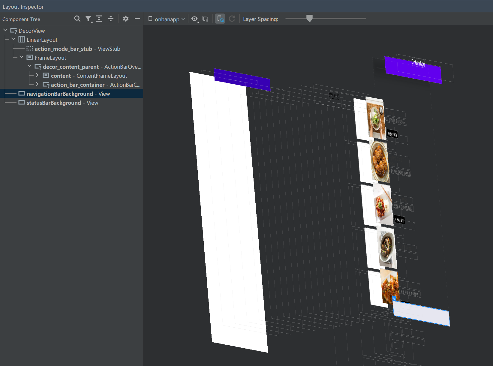
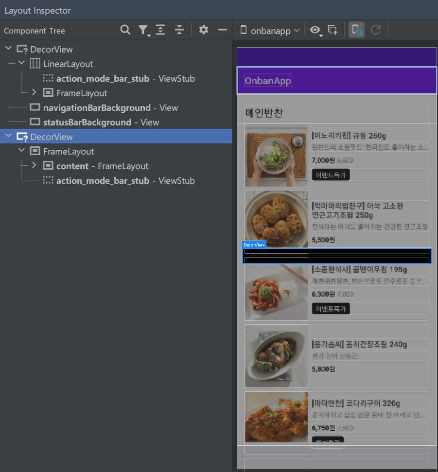

### Window

Window는 Android에서 Ui를 구성하는 가장 최상단의 구성요소라고 할수 있다. 우리가 사용하는 데스크톱 시스템에서 창이라 부르는 그것과 비슷하게 Window는 Android System내에 Ui를 그릴수 있는 도화지를 제공하는 것이다. 한마디로 시스템에서 제공하는 StatusBar, NavigationBar, Dialog, Activity등이 결국엔 Window 그려지게 되는 것이다.



위 사진은 Layout Inspector를 통해 볼수 있는 일반적인 Activity의 계층구조이다. DecorView 안에는 익숙한  우리가 setContentView로 선언한 View와 statusbar, navigationbar의 배경을 담당하는 3가지 View가 있다.

##### DecorView

그렇다면 우리의 화면을 그려주는 DecorView는 무엇일까? 사실 Window는  추상 클래스로 실제로 Window를 구현하는 부분은 PhoneWindow다 그리고 DecorView란 PhoneWindow가 가지고 있는 RootView로서 Window의 View라고 말할 수 있다.

~~PhoneWindow는 코드가 공개되어 있지 않다.~~

```java
Activity.class
...
public Window getWindow() {
    return mWindow;
}
...
final void attach(Context context, ActivityThread aThread...
	mWindow = new PhoneWindow(this, window, activityConfigCallback);
...
                  
    public void setContentView(View view) {
        getWindow().setContentView(view);
        initWindowDecorActionBar();
    }
```


그래서 Activity는 PhoneWindow를 시스템에게 할당 받아 화면에 Ui를 그려줄수 있는 것이다.

### WindowManager

WindowManager는 이름 그대로 Window를 관리하는 class이다. 일반적인 경우 우리가 멀티윈도우를 사용하거나,  Activity를 전환하거나 앱을 키고 닫을때 WindowManager가 이를 관리해 화면을 표시해준다.

그러므로 우리가 일반적으로 windowManager를 사용하는 경우는 많지 않다. 

#### Bubble, FloatingView


`windowManager.addView(floatView, paramFloat)`

최근에는 이렇게 앱위에 아이콘이 떠있는 형태의 디자인을 가끔 볼 수 있다. 이는 WindowManager를 통해 최상단 Window를 가져와 CustomView를 추가 하는 방식으로 구현 할 수 있다.


### Dialog

Dialog와 Activity는 다른 Window를 가진다고 일반적으로 알려져 있다. 실제로 Dialog 코드를 살펴보면 Dialog가 생성되면 PhoneWindow를 통해 새로운 Window를 생성하고 show할때 FloatingView와 동일하게 WindowManager에게 addView를 하는 모습을 볼 수 있다. 

그리고 LayoutInpector를 사용해 계층 구조를 살펴보면 Dialog가 추가되면 DecorView가 새롭게 추가되는 모습을 볼 수 있다. 

실제로 Dialog는 Activity와 다른 Window를 가진다는 사실을 확인 할 수 있었다. 그리고 Dialog에는 DialogFragment라는 class도 존재하는데 Fragment가 Activity에 종속된다는 점에서 같은 Window일수 있지 않을까 했지만 일반 Dialog와 똑같이 DialogFragment도 새로운 Window를 가짐을 확인 할 수 있었다. 

그렇다면 DialogFragment FragmentManager를 전달하고 Dialog를 Show하는 이유가 뭘까?

그 이유는 원래의 Dialog는 Activity처럼 자체적인 생명주기를 가지고 있는데 이때문에 Activity가 종료 되어도 그대로 화면에 남아있거나 하는 오류가 발생하기도 했기 때문이다. 그래서 Fragment가 가지는 Activity의 종속성을 활용해 Dialog도 Activity의 생명주기에 따르도록 설계한 것이 DialogFragment 인 것이다.

```java
Dialog.class...
public Dialog(@NonNull Context context, @StyleRes int themeResId, boolean createContextThemeWrapper) {
        mWindowManager = (WindowManager)context.getSystemService(Context.WINDOW_SERVICE);
        final Window w = new PhoneWindow(mContext);
        mWindow = w;
    ...
}
public void show() {
    ...
    mDecor = mWindow.getDecorView();
    ...
    mWindowManager.addView(mDecor, l);
    ...
}
```




### Window부터 View까지 터치과정

View의 터치과정은 아래그림이 가장 적절하게 표현한다 연속되는 dispatchTouchEvent가 View들을 순회하고, ViewGroup에 존재하는 onInterceptTouchEvent가 false일경우 계속해서 자식으로 TouchEvent를 전파한다 그리고  onInterceptTouchEvent가 True라면 더이상의 전파는 없이 onTouchEvent로 이벤트를 전달하게 된다.


### 다른 Window가 우리에게 끼치는 영향

사실 이 주제를 생각하게된 이유는 아래와 같이 Dialog를 띄워 놓은 상태에서 반투명 처리된 Dim부분을 터치하고 싶었기 때문입니다. 그래서 왜 터치가 안되는지와 터치를 하려고 TouchEvent에 대해 알아 볼 필요가 있었습니다.

첫번째 이유는 알수 있었습니다. Dialog와 Activity는 Window가 다르다! 그렇기 때문에 TouchEvent가 전달되지 않았습니다. 

그렇다면 왜 TouchEvent가 전달되지 않을까?

```java
Activity.class
public boolean dispatchTouchEvent(MotionEvent ev) {
    if (ev.getAction() == MotionEvent.ACTION_DOWN) {
        onUserInteraction();
    }
    if (getWindow().superDispatchTouchEvent(ev)) {
        return true;
    }
    return onTouchEvent(ev);
}
WindowCallbackWrapper.class
public class WindowCallbackWrapper implements Window.Callback {
    @Override
    public boolean dispatchTouchEvent(MotionEvent event) {
        return mWrapped.dispatchTouchEvent(event);
    }
    ...
```

dispatchTouchEvent가 호출되는 부분이 바로 Window기 때문이다 한마디로 Window가 다르니 Dialog에서 소비된 TouchEvent는 다른 Window인 Activity로 전달될수 없는 것이다.

### 


Window 에서 View까지 이벤트 처리과정

1. Activity의 Window를 WindowManagerService에등록

2. 이벤트 발생시 KeyInputQueue 에 이벤트가 쌓이고

3. WindowManagerService에 Dispatch 메소드 호출

4. 이벤트를 전달 받은 윈도우는 하위 Ui컴포넌트에 터치이벤트를 실행

   