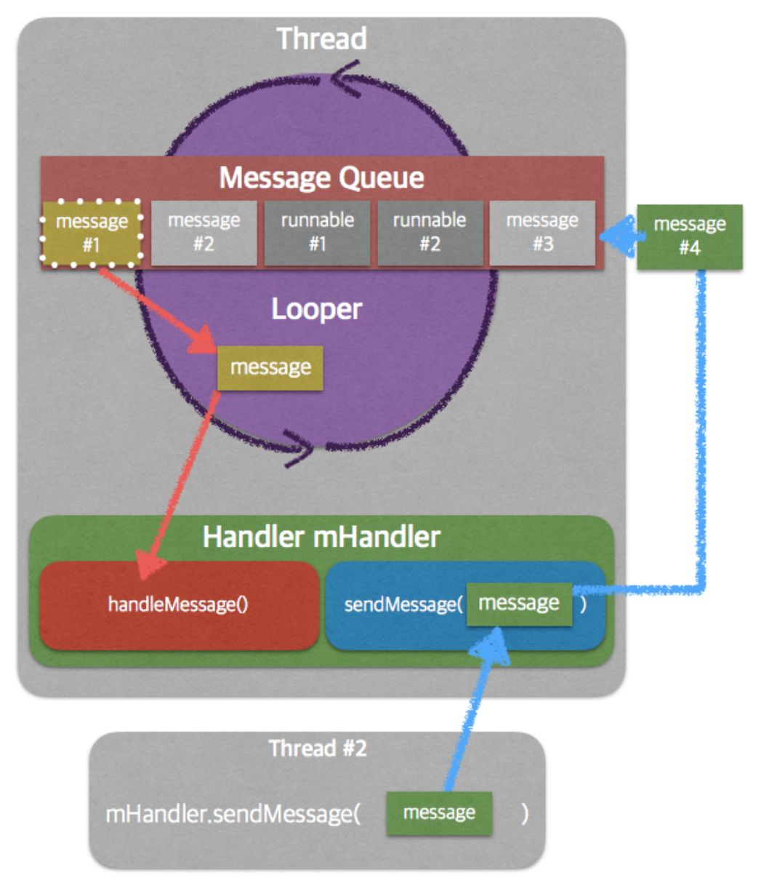

### Android Thread

일반적인 어플리케이션에서는 성능을 위해 `Multi Thread`를 사용하지만, UI를 업데이트 하는데는 교착상태, 데드락 등을 방지하기 위해서  `Single Thread`를 주로 사용한다. 

`Android` 에서 `App process`가 시작되면 `MainThread`가 시작되는데 `MainThread`가 `UI`를 유일하게 수정할수 있는 `Thread`이기 때문에  `MainThread`라 하면 일반적으로 UI Thread라고 한다.

`Java` 어플리케이션 에서는 `main()` 메소드로 실행되는 것이 `Main Thread`인데 안드로이드에서는 ActivityThread.class에 있는 `main()` 메소드가 앱의 시작점이다

```java
public static void main(String[] args) {
	... 중략
    Looper.prepareMainLooper(); // Looper를 준비

    ActivityThread thread = new ActivityThread();
    thread.attach(false, startSeq);
    
    ... 중략

    // End of event ActivityThreadMain.
    Trace.traceEnd(Trace.TRACE_TAG_ACTIVITY_MANAGER);
    Looper.loop(); // Lopper 실행

    throw new RuntimeException("Main thread loop unexpectedly exited");
}
```

ActivityThread에서 가장 중요한 부분은 `Lopper`라고 할수 있는데 

Looper.prepareMainLooper()를 통해 `Lopper`를 준비하고 `Looper.loop()`를 통해 UI 관련 처리를 실행한다.  그리고 `Lopper.loop()`에는 무한 반복문이 있어 `main()` 메서드는 프로세스가 종료되지 않게 해준다.

### Looper 



위 사진은 Android의 Thread같의 통신 방법을 보여준다 MainThread는 Looper를 가지고 Message Queue에 있는 Message를 처리하고 Handler를 통해 Message를 Queue에 넣나 처리한 결과를 알려준다.

여기서 `Looper`는 안드로이드에서 중요한 통신수단이라고 할수 있다.

`Lopper` 는 `TSL(thread local storage)`에 저장되고 꺼낼수 있다 

```java
@UnsupportedAppUsage
static final ThreadLocal<Looper> sThreadLocal = new ThreadLocal<Looper>();
...
private static void prepare(boolean quitAllowed) {
    if (sThreadLocal.get() != null) {
        throw new RuntimeException("Only one Looper may be created per thread");
    }
    sThreadLocal.set(new Looper(quitAllowed));
}
```

`TSL`은 `Thread`의 범위로 선언하는 변수로 `prepare()` 할때 현재 `Thread`에 `Looper`가 없다면 새롭게 생성하고 `TSL`에 저장해 두어 `Thread`마다 하나의 `Looper`를 가지게 되어있다.

`Looper`는 각각의 `Message Queue`를 가지는데 이를 통해 Ui작업에서 경합 상태를 해결한다. 

```java
public static void loop() {
    final Looper me = myLooper();
    final MessageQueue queue = me.mQueue;

    for (;;) {
        Message msg = queue.next(); // might block
        if (msg == null) {
            // No message indicates that the message queue is quitting.
            return;
        }
        ... 중략
        try {
            msg.target.dispatchMessage(msg);
            if (observer != null) {
                observer.messageDispatched(token, msg);
            }
            dispatchEnd = needEndTime ? SystemClock.uptimeMillis() : 0;
        } catch (Exception exception) ...
        msg.recycleUnchecked();
    }
}
```

`Looper`가 실행되는 `loop()`를 살펴보면 `messageQueue`에서 하나씩 `message`를 꺼내고 `msg`가 `null`일때 `loop()`를 종료하는 것을 볼 수 있다. 그리고 `dispatchMessage`를 실행하는 `target`은 `Handler`로 `Message`를 처리함을 알려준다

### Handler 

`Handler`는 `Message`를 `MessageQueue`에 넣는 기능과 `MessageQueue`에서 `Message`를 꺼내 처리하는 기능을 제공한다. 그리고 이를 통해 우리가 `Background Thread`에서 `MainThread`에 Ui를 업데이트를 요청 할 수있도록 도와준다.

`Handler`의 기본생성자는 `Deprecated`되었는데 그 이유는 `Handller`에 `looper`를 지정하지 않으면 자동으로 `Looper`를 선택하게 되는데 그때 현재 `Thread`에 `Looper`가 없을 수도 있고, 의도와 다른 `Looper`를 선택해 의도하지 않은 동작을 발생시 킬 수 있어 `Deprecated`되었다고 한다. 그래서 우리는 보통 `MainLooper`를 가져와 일반적으로 `Handler`를 생성한다.

그래서 최종적으로 `Looper`가 호출하는 `dispatchMessage`를 `Handler`는 수신받고 우리가 `callback`을 통해 `Message`객체를 수신 받게되는 것이다. 

```java
@Deprecated
public Handler() {
    this(null, false);
}

//Looper에서 호출하는 dispatchMessage
public void dispatchMessage(@NonNull Message msg) {
    if (msg.callback != null) {
        handleCallback(msg);
    } else {
        if (mCallback != null) {
            if (mCallback.handleMessage(msg)) {
                return;
            }
        }
        handleMessage(msg);
    }
}

// Handler 생성
Handler(Looper.getMainLooper()) {
    //handleMessage
    return@Handler true
}
```

#### -Delayed, -AtTime Handler의 처리 시점

앞서 `Looper`는 Message Queue를 통해 `Message`를 처리 한다고 했다. 그렇다면 `Message`의 처리가 지연 된다면 뒤에 `Message`도 지연될까?

```kotlin
val handler = Handler(Looper.getMainLooper())
handler.postDelayed({
    Log("200ms delay")
}, 200)
handler.post({
    delay(500)
})
```

`Handler`의 `Delayed`, `AtTime`은 실행 시점을 보장하지 않는다 앞에 `Message`의 처리가 지연된다면 뒤에 `Message`들도 자연스럽게 딜레이 된다. 

그래서 위에 "200ms delay"는 최소한 500ms 뒤에 실행되게 된다

### Background에서 UI수정하기

```java
// 1. Handler
Handler handler = new Handler(Looper.getMainLooper())
handler.post({
    //UI UPdate
})

// 2. runOnUiThread
public final void runOnUiThread(Runnable action) {
    if (Thread.currentThread() != mUiThread) {
        mHandler.post(action);
    } else {
        action.run();
    }
}

// 3. View.post
public boolean post(Runnable action) {
    final AttachInfo attachInfo = mAttachInfo;
    if (attachInfo != null) {
        return attachInfo.mHandler.post(action);
    }

    // Postpone the runnable until we know on which thread it needs to run.
    // Assume that the runnable will be successfully placed after attach.
    getRunQueue().post(action);
    return true;
}
```

Background에서 UI를 업데이트 하려고 에러 메시지와 같이 종료 될텐데

이를 방지하고 update하는 방법은 일반적으로 3가지가 있다

첫번째는 `Handler`를 통해 `update`하는 것이다 Handler에서 처리하는 내용은 `MainThread`에서 실행되므로 `Background`에서 처리를 마친뒤 `Handler`로 데이터만 전달해 Ui를 update하는 것이다.

두번째는 `Activity`의 `runOnUiThread`로 첫번째 방법을 메소드로 만들어 둔 것 인데 현재 `Thread`가 `MainThread`라면 그냥 실행하고 다른 `Thread`라면 `Handler`를 통해 처리한다

세번째는 `View`에 있는 `post`기능이다 `View`를 통해 `MainThread`의 `Handler`에 접근해 Ui를 update 할 수 있다. 그러나 이방법은 `View`가 `Attached`상태일 때만 동작한다

세가지 방법 모두 결국엔 Handler를 통해 동작함을  볼수 있다. 이렇게 Android 는 `Thread`간 통신의 `Handler`를 다양하게 사용 하는 것을 볼수 있다. 

최근에는 `LiveData`나 코루틴, Rxjava같이 새로운 기술들이 많이나와 `Handler`를 직접 사용하는 경우가 적어졌지만 이런 기술들이 `Handler`를 바탕으로 동작함을 알아야 한다. 