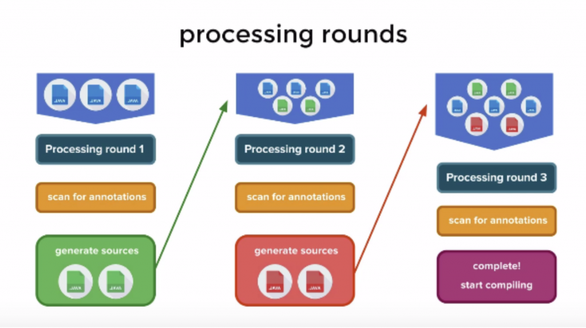

# Annotation

# Annotation

> *Annotations are means of attaching metadata to code.*

코드에 대한 메타데이터.

**NOTE**: 메타데이터란 애플리케이션이 처리해야 할 데이터가 아니라, 컴파일 과정과 실행 과정에서 어떻게 컴파일하고 처리할 것인지를 알려주는 정보.

애노테이션은 다음 세 가지 용도로 사용된다.

- 컴파일러에게 코드 문법 에러를 체크하도록 정보를 제공 - (`@Null`, `@NotNull`)
- 소프트웨어 개발 툴이 빌드나 배치 시 코드를 자동으로 생성할 수 있도록 정보를 제공 - (애노테이션 프로세서)
- 런타임에서 특정 기능을 실행하도록 정보를 제공 - (reflection)

코틀린에서는 프로퍼티, 클래스, 메소드 등 애노테이션 타겟에 at sign(`@`)과 함께 적용할 수 있다.

```kotlin
@Singleton
class Foo
```

## Custom Annotation

커스텀 애노테이션은 `annotation class` 예약어를 사용하여 정의할 수 있다.

```kotlin
annotation class CustomAnnotation
```

애노테이션 클래스도 일반적인 클래스와 마찬가지로 프로퍼티를 가질 수 있다. 대신 프로퍼티로 사용할 수 있는 타입은 제한되며 Nullable 타입을 사용할 수 없는데, 사용 가능한 타입 목록은 다음과 같다.

- 원시 타입(Int, Long, Double, ...)
- String
- Class 타입
- Enum
- Other Annotation
- 위에 표시된 타입에 대한 배열 타입

```kotlin
annotation class CustomAnnotation(val name: String)
```

애노테이션 클래스에 대해 메타-애노테이션을 적용하여 추가적인 정보를 명시할 수도 있다. 애노테이션 클래스에 적용 가능한 메타 애노테이션은 다음과 같다.

- `@Target`: 애노테이션의 적용 대상을 명시한다.
- `@Retension`: 애노테이션의 범위를 어디까지 유지할 지 명시할 수 있다.
- `@Repeatable`: 단일 타겟에 대해 같은 애노테이션을 여러 번 적용 가능한지 명시한다.
- `@MustBeDocumented`: 애노테이션이 public API에 포함되며, 애노테이션이 적용되는 타겟의 문서에 포함되어야 함을 명시한다.

### @Target

```kotlin
@Target(AnnotationTarget.ANNOTATION_CLASS)
@MustBeDocumented
public annotation class Target(vararg val allowedTargets: AnnotationTarget)
```

`@Target` 애노테이션은 애노테이션 클래스가 적용될 수 있는 대상을 제한할 수 있다. 프로퍼티로 AnnotationTarget을 받는데, 이는 kotlin.annotation.Target에 위치한 enum class로 다음 값들을 포함한다.

```kotlin
public enum class AnnotationTarget {
    /** Class, interface or object, annotation class is also included */
    CLASS,
    /** Annotation class only */
    ANNOTATION_CLASS,
    /** Generic type parameter */
    TYPE_PARAMETER,
    /** Property */
    PROPERTY,
    /** Field, including property's backing field */
    FIELD,
    /** Local variable */
    LOCAL_VARIABLE,
    /** Value parameter of a function or a constructor */
    VALUE_PARAMETER,
    /** Constructor only (primary or secondary) */
    CONSTRUCTOR,
    /** Function (constructors are not included) */
    FUNCTION,
    /** Property getter only */
    PROPERTY_GETTER,
    /** Property setter only */
    PROPERTY_SETTER,
    /** Type usage */
    TYPE,
    /** Any expression */
    EXPRESSION,
    /** File */
    FILE,
    /** Type alias */
    @SinceKotlin("1.1")
    TYPEALIAS
}
```

### @Retention

`@Retention` 애노테이션은 대상에 적용된 애노테이션을 어느 범위까지 유지할 것인지 지정하는 메타 애노테이션이다. 즉 적용된 애노테이션을 소스상에서만 유지할 지, 컴파일된 클래스까지 유지할 지, 런타임에도 유지할 지 지정할 수 있다.

```kotlin
@Target(AnnotationTarget.ANNOTATION_CLASS)
public annotation class Retention(val value: AnnotationRetention = AnnotationRetention.RUNTIME)
```

애노테이션의 파라미터로 AnnotationRetention 타입의 값을 받는데 적용 가능한 타입의 리스트는 다음과 같다.

```kotlin
public enum class AnnotationRetention {
    /** Annotation isn't stored in binary output */
    SOURCE,
    /** Annotation is stored in binary output, but invisible for reflection */
    BINARY,
    /** Annotation is stored in binary output and visible for reflection (default retention) */
    RUNTIME
}
```

**NOTE**: 리플렉션(Reflection)이란 런타임 시 클래스의 메타 데이터를 얻는 기능을 말한다. 예를 들어 클래스가 가지고 있는 필드가 무엇인지, 어떤 생성자를 가지고 있는지, 어떤 메소드를 가지고 있는지, 적용된 애노테이션이 어떤 것인지 알아낼 수 있다.

리플렉션을 이용하여 런타임에서 애노테이션 정보를 얻기 위해서는 RetentionPolicy를 `RUNTIME`으로 지정해야 한다. GSON의 `@SerializedName` 같은 애노테이션이 여기에 해당한다.

## use-site target

코틀린은 자바와 달리 프로퍼티 개념을 지원하므로 하나의 구문에 다수의 애노테이션 타겟이 포함될 수 있다. 따라서 단순히 프로퍼티에 애노테이션을 적용하는 것으로는 적용 대상이 모호해질 수 있는데 이를 위해 코틀린에서는 애노테이션의 적용 대상을 명시해줄 수 있다.

use-site target이 적용된 애노테이션은 다음의 형태를 가진다.

```kotlin
class Example(@field:Ann val foo,    // annotate Java field
              @get:Ann val bar,      // annotate Java getter
              @param:Ann val quux)   // annotate Java constructor parameter
```

사용 가능한 use-site target 목록은 다음과 같다.

- `file`
- `property` (annotations with this target are not visible to Java)
- `field`
- `get` (property getter)
- `set` (property setter)
- `receiver` (receiver parameter of an extension function or property)
- `param` (constructor parameter)
- `setparam` (property setter parameter)
- `delegate` (the field storing the delegate instance for a delegated property)

## Reflection

리플렉션 관련 내용은 Kotlin in Action을 보는 것을 추천.

# Annotation Processor

컴파일 타임에 애노테이션을 스캔하고 처리하도록 javac에 포함된 도구. 특정 애노테이션에 대해 고유한 애노테이션 프로세서를 등록하여 코드 베이스를 검사, 수정 또는 생성하는 데 상요된다. 애노테이션 프로세서를 적재적소에 잘 사용한다면 개발자의 작업 및 코드를 단순화할 수 있다.

## 애노테이션 프로세스의 처리 과정



출처: [https://www.charlezz.com/?p=1167](https://www.charlezz.com/?p=1167)

애노테이션 프로세서는 여러 라운드에 걸쳐 진행된다.

컴파일 시 애노테이션 프로세서가 동작하며 애노테이션에 대해 코드를 생성하고, 생성된 코드에 대해 다시 애노테이션 프로세스가 동작한다.

이 과정은 처리가 필요한 애노테이션이 더 이상 존재하지 않을 때 까지 반복된다.

## 애노테이션 프로세서의 예시

커스텀 애노테이션 프로세서를 설계하는 과정은 아래 두 블로그가 가장 잘 설명해주고 있다고 생각한다. 커스텀 애노테이션 프로세서를 만들기 위해 필요한 과정을 설명하거나, 실제 사용중인 라이브러리에서 애노테이션 프로세서를 어떻게 사용하는지 분석 할 수도 있지만 당장 이 기능이 필요하거나 가까운 시일에 구현해야 할 필요가 없기 때문에 지금은 이정도로만 소개하고 링크를 첨부하는 것으로 마치려한다.

**[[Android] Annotation Processor 만들기](https://www.charlezz.com/?p=1167)**

**[Annotation 안에서 무슨 일이 일어나는 거지? 2편](https://blog.gangnamunni.com/post/kotlin-annotation-codegeneration/)**

# KSP

코틀린은 자체적은 애노테이션 프로세싱 시스템을 가지고 있지 않기 때문에 Room 처럼 애노테이션 프로세서를 사용하는 라이브러리는 kapt(kotlin annotation processing tool)를 통해 자바 애노테이션 프로세싱 시스템을 사용한다. 하지만, 이로 인해 불필요한 자바 Stub을 생성하게 되고, 빌드 속도에 안좋은 영향을 끼치게 된다.

KSP는 코틀린에서 더 빠른 빌드 속도를 위해 개발되었다. KSP는 코틀린을 위한 애노테이션 프로세싱 시스템으로 자바 스텁을 생성하지 않고 코틀린 코드를 분석하여 빌드 속도가 저하되는 문제를 해결한다. 벤치마크에 따르면 KAPT보다 대략 2배 정도 빠른 성능을 보여주고 있다고 말한다.

물론 아직 베타 버전이며, 구글 라이브러리 위주로 도입이 시작되고 있기 때문에 당장 적용하는것은 무리가 있겠지만, 빌드 타임 관련 문제를 겪고 있다면 고려해볼 수도 있을 것 같다.

# 참고

[https://kotlinlang.org/docs/annotations.html](https://kotlinlang.org/docs/annotations.html)

[https://github.com/3tudy/kotlin/blob/master/Kotlin in Action/chapter10/chapter10.md](https://github.com/3tudy/kotlin/blob/master/Kotlin%20in%20Action/chapter10/chapter10.md)

[https://blog.gangnamunni.com/post/kotlin-annotation/](https://blog.gangnamunni.com/post/kotlin-annotation/)

[https://blog.gangnamunni.com/post/kotlin-annotation-codegeneration/](https://blog.gangnamunni.com/post/kotlin-annotation-codegeneration/)

[https://www.charlezz.com/?p=1167](https://www.charlezz.com/?p=1167)

[https://yoon-dailylife.tistory.com/111](https://yoon-dailylife.tistory.com/111)

[https://velog.io/@jshme/KSP-Kotlin-Symbol-Processor-톺아보기](https://velog.io/@jshme/KSP-Kotlin-Symbol-Processor-%ED%86%BA%EC%95%84%EB%B3%B4%EA%B8%B0)

[https://www.charlezz.com/?p=45255](https://www.charlezz.com/?p=45255)

[https://developers-kr.googleblog.com/2021/02/announcing-kotlin-symbol-processing-ksp.html](https://developers-kr.googleblog.com/2021/02/announcing-kotlin-symbol-processing-ksp.html)

[https://soda1127.github.io/introduce-kotlin-symbol-processing/](https://soda1127.github.io/introduce-kotlin-symbol-processing/)